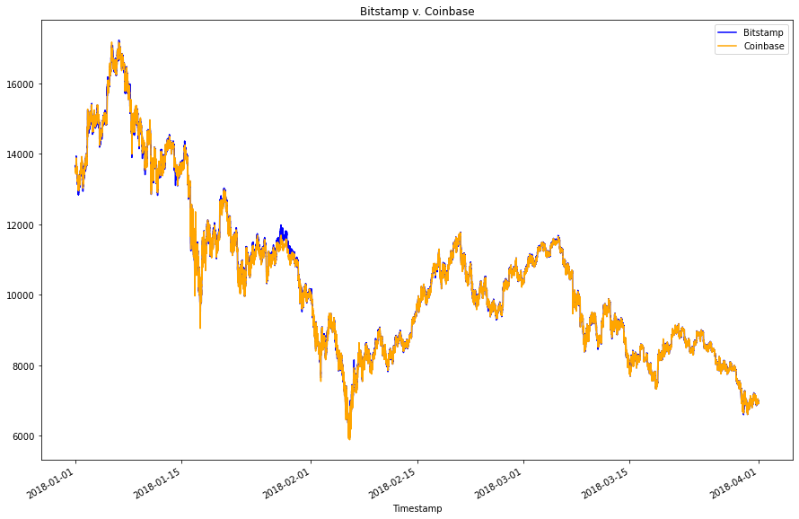
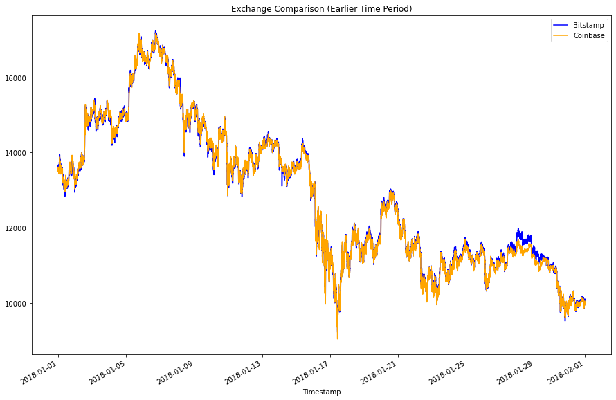

# Crypto_Arbitrage
Using pandas to analyze arbitrage opportunities via historical data on two different exhanges  

---

## Technologies

In this project we are utilizing Python 3, Jupyter Lab, and the Pandas Library  
Pandas library -- Incredibly useful Python library for data science and data analysis  
Jupyter Lab -- Robust environment to be able to view and edit devopment projects in a streamlined system.

---

## Installation Guide

* Pandas -- The source code is currently hosted on GitHub at: https://github.com/pandas-dev/pandas

Binary installers for the latest released version are available at the Python Package Index (PyPI) and on Conda.

### conda
`conda install pandas`
### or PyPI
`pip install pandas`

* Jupyter Lab -- 
    [Link for detailed instructions on installing Jupyter Lab here.](https://jupyter.org/install)


---

## Usage

## There are several examples of different ways to plot exchange data for Bitcoin prices throughout this project, illustrating different arbitrage opportunities over time.

### Here we initially compare the prices of Bitcoin between the two exchanges over the duration of the data set --  

```python 
bitstamp_sliced.plot(legend = True, figsize = (15,7), 
title = 'Bitcoin prices on Bitstamp vs. Coinbase exchanges over time',
color = 'blue', label = 'Bitstamp prices')
coinbase_sliced.plot(legend = True, figsize = (15,7), 
color = 'red', label = 'Coinstamp prices')
```  

<<<<<<< HEAD

=======

>>>>>>> af0469e29cce085c98a28fa35001f0db8164dd48

### We then can zoom in on more granular timeframes:  

```python  
bitstamp_sliced.loc['2018-01-01' : '2018-01-31'].plot(legend = True, figsize = (15,7), 
title = 'Bitcoin prices on Bitstamp vs. Coinbase exchanges for January 2018',
color = 'blue', label = 'Bitstamp prices')
coinbase_sliced.loc['2018-01-01' : '2018-01-31'].plot(legend = True, figsize = (15,7), 
color = 'red', label = 'Coinstamp prices') 
```  

<<<<<<< HEAD

=======
  
>>>>>>> af0469e29cce085c98a28fa35001f0db8164dd48

### In addition to generating different plots and overlay plots of the exchange data, we also perform calculations to identify arbitrage opportunities in the different time periods we are analyzing, even narrowing opportunities down to those above as certain threshold as in the example below:  

Here we calculate certain arbitrage opportunities for January 1st, 2018 --  

```python  
profitable_trades_early = spread_return_early.loc[spread_return_early > 0.01] 
```

<<<<<<< HEAD
**Timestamp  
=======
**Timestamp
>>>>>>> af0469e29cce085c98a28fa35001f0db8164dd48
2018-01-01 09:10:00    0.011455  
2018-01-01 23:25:00    0.022465  
2018-01-01 23:26:00    0.024616  
2018-01-01 23:27:00    0.015948  
<<<<<<< HEAD
2018-01-01 23:28:00    0.011261  
=======
2018-01-01 23:28:00    0.011261
>>>>>>> af0469e29cce085c98a28fa35001f0db8164dd48

### Data and formulas can be manipulated to assess other datasets by importing different data and changing the formulas to reflect the needed changes.


---

## License

Licensed under the [MIT License](https://github.com/git/git-scm.com/blob/main/MIT-LICENSE.txt)  Copyright 2021 Dave Thomas.
